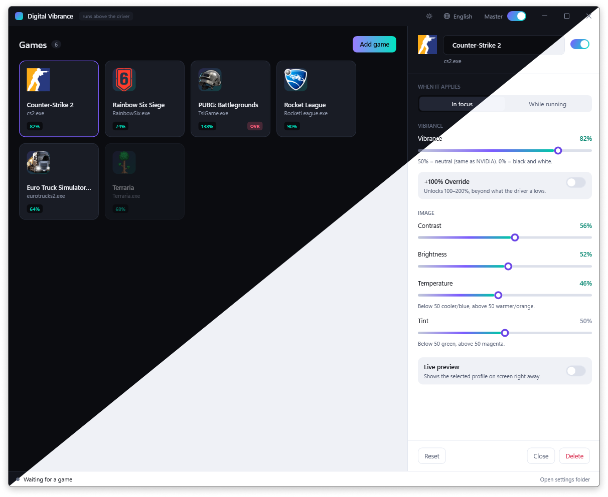
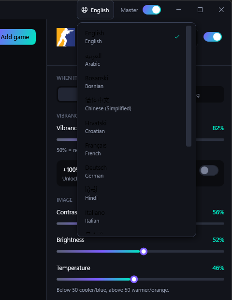

<div align="center">


# Digital Vibrance

**Per-game colour profiles for Windows — running above the GPU driver, not inside it.**

Set vibrance, contrast and white balance per game. Digital Vibrance switches profiles the
moment a game takes focus and puts the screen back to normal when you leave it.




</div>

---

## Why this exists

NVIDIA's Digital Vibrance lives in the Control Panel, AMD's Saturation lives in Adrenalin, and
Intel has its own thing. All three are global, none of them switch per game, and every driver
update has a habit of resetting them.

Digital Vibrance takes a different route. It never opens, reads or writes driver settings —
it applies its own colour layer on top of the desktop compositor. Whatever your driver is
doing, this sits above it.

| | Driver control panel | Digital Vibrance |
|---|---|---|
| Per-game profiles | ✗ | ✓ |
| Works on NVIDIA + AMD + Intel | ✗ | ✓ |
| Survives driver updates | ✗ | ✓ |
| Needs admin rights | sometimes | ✗ |
| Touches driver settings | ✓ | ✗ |

---

## Features

- **Per-game profiles** — add a game, dial in its look, forget about it.
- **Automatic switching** — profiles apply on focus or for as long as the process runs.
- **+100% Override** — pushes vibrance to 200%, past what any driver will let you set.
- **Live preview** — changes land on screen as you drag the slider.
- **Vendor-neutral** — one code path for every GPU. No NVAPI, no ADL, no vendor SDKs.
- **Nothing injected** — no hooks, no overlay, no DLL injection into your games. Safe with
  anti-cheat, because it never goes near the game process.
- **Light and dark themes**, matching your Windows theme on first run and switching instantly.
- **16 languages** with instant switching, including right-to-left layouts.
- **Drag & drop** an `.exe` onto the window to add a game.
- **Lives in the tray** and restores the screen cleanly on exit.

---

## How it works

Everything runs through the Windows **Magnification API**
(`MagSetFullscreenColorEffect`) — the same mechanism behind the built-in Color Filters
accessibility feature. The effect is applied by the desktop compositor (DWM), which is why it
behaves identically on every GPU vendor and needs no elevated privileges.

Each slider contributes to a single 5×5 colour matrix, composed once and handed to the
compositor:

```
white balance  →  saturation  →  contrast  →  brightness
```

Saturation uses Rec.709 luma weights (0.2126 / 0.7152 / 0.0722) — the same shape of transform
NVIDIA's Digital Vibrance performs inside the driver.

A lightweight watcher polls the foreground window and running processes to decide which
profile is active. If several profiles match, the one you are actually looking at wins.

---

## Controls

| Control | Range | What it does |
|---|---|---|
| **Vibrance** | 0–100% (200% with Override) | 50% is neutral, matching NVIDIA's scale. 0% is black and white. |
| **+100% Override** | on / off | Unlocks 100–200%, beyond what the driver allows. |
| **Contrast** | 0–100% | Pivots around mid grey. |
| **Brightness** | 0–100% | Additive offset. |
| **Temperature** | 0–100% | Below 50 cooler/blue, above 50 warmer/orange. |
| **Tint** | 0–100% | Below 50 green, above 50 magenta. |

Every slider is centred on **50 = neutral**, deliberately matching the NVIDIA scale so numbers
you already know still mean the same thing.

**When a profile applies**

- **In focus** — colours are active only while the game window is focused. Alt-tab returns the
  desktop to normal.
- **While running** — colours stay active for as long as the game process lives.

---

## Languages



Digital Vibrance ships with 16 languages. On first run it follows your Windows display
language; after that the 🌐 button in the title bar switches on the spot — **no restart**.

English · Bosanski · Hrvatski · Srpski · Deutsch · Italiano · Español · Français
· Português · Polski · Русский · Türkçe · العربية · हिन्दी · 简体中文 · 日本語

Arabic flips the entire layout to right-to-left.

**Adding your own** — drop a `.json` file into
`%AppData%\DigitalVibrance\Languages\`. Files there take priority over the built-in ones, so
you can also correct an existing translation without rebuilding. Copy
[`en.json`](src/DigitalVibrance/Localization/Languages/en.json) as your starting point. Any
key you leave out falls back to English, so a partial translation never breaks the UI.

<br clear="right">

---

## Getting started

Requires the [.NET 8 Desktop Runtime](https://dotnet.microsoft.com/download/dotnet/8.0).

```bash
git clone https://github.com/SYTStudio/DigitalVibrance.git
cd DigitalVibrance
dotnet run --project src/DigitalVibrance/DigitalVibrance.csproj
```

Build a standalone executable:

```bash
dotnet publish src/DigitalVibrance/DigitalVibrance.csproj -c Release -o publish
```

Settings are stored in `%AppData%\DigitalVibrance\config.json`.

---

## Limitations

Worth knowing before you wonder why something isn't working:

- **Exclusive fullscreen bypasses DWM**, so the effect does not reach it. Set the game to
  **borderless / fullscreen windowed** — which is how most modern games run by default anyway.
- **HDR** changes the colour pipeline; the effect may look different or disappear entirely
  while HDR is on.
- **Windows Color Filters** (Settings → Accessibility → Colour filters) uses the same API and
  will fight with this app. Keep it off.
- **Above 100% vibrance colours clip** — detail in bright areas is lost. That is exactly why
  Override is a separate switch rather than just a longer slider.
- The effect is **global**: it covers the whole screen, not just the game window. That is what
  the *In focus* mode is for — alt-tab and the desktop returns to normal.

If the app crashes or is killed from Task Manager, Windows drops the effect automatically.
The screen cannot get stuck with the wrong colours.

---

## Project structure

```
src/DigitalVibrance/
├─ Core/           colour matrix, profile models, MVVM base
├─ Interop/        P/Invoke declarations (Magnification, user32, kernel32)
├─ Services/       engine thread, game detection, JSON storage, icons
├─ Localization/   string table + 16 languages (Languages/*.json)
├─ ViewModels/     the logic deciding which profile is active
├─ Views/          main window + slider component
└─ Themes/         Dark.xaml + Light.xaml palettes, Theme.xaml styles
```

---

<div align="center">

## Support

Digital Vibrance is free to use. If it earned a permanent spot in your setup,
you can buy me a coffee — entirely optional, never nagged about in the app.

[](https://www.paypal.me/SamiBeat)

</div>

